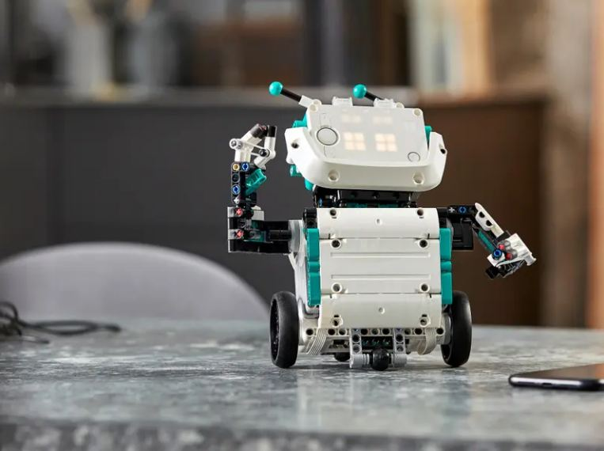
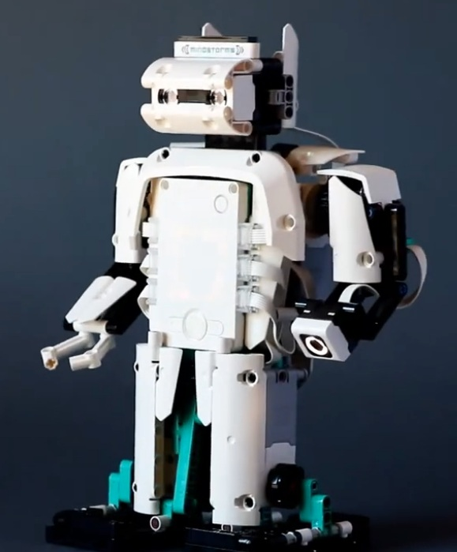
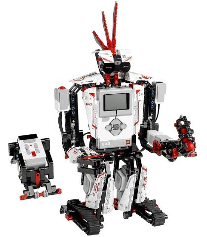
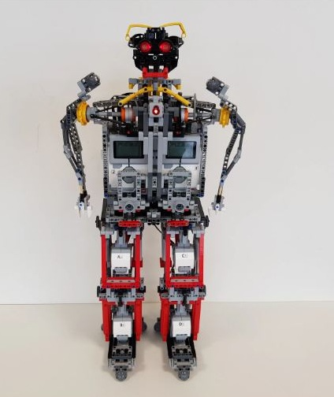
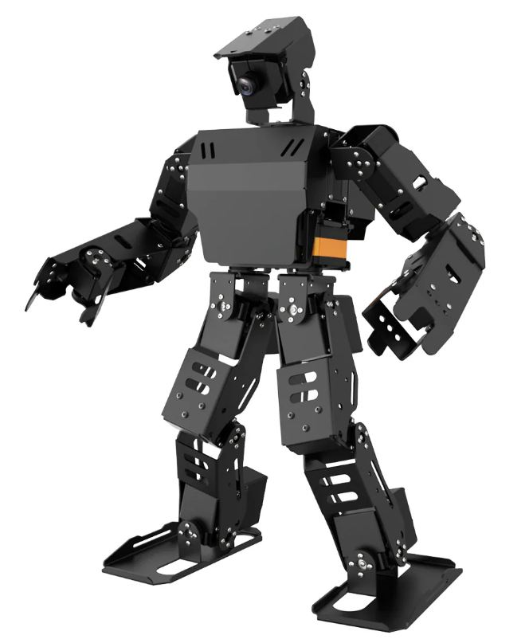
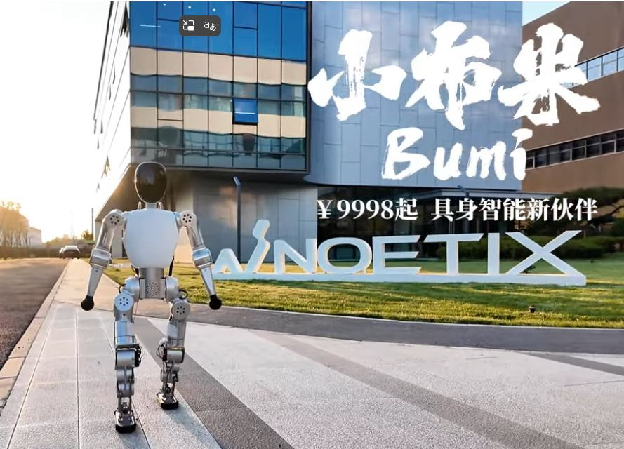

# 🤖 OpenHomeRobot
### *“When AI leaves the cloud and walks among us.”*

OpenHomeRobot is an open, experimental journey to bring **Large Language Models (LLMs)** to life —  
not just as chatbots, but as **humanoid companions** that can see, move, listen, and act in the real world.

This project explores how **public and self-hosted AI models** can control **physical robots** through a middleware called the **MCP Server (Model Context Protocol)** — turning language into motion, one command at a time.

---

## 🧱 Hardware note: LEGO model choice

I'm not yet settled on a specific LEGO build (EV3/Robot Inventor variants, custom humanoids, etc.). The immediate focus is the software and control architecture — getting the AI → MCP → motion loop solid — rather than the perfect DIY LEGO robot. The exact model can evolve as the control stack matures.

---

## 🚀 Vision

The long-term goal is to make humanoid robotics accessible and intelligent enough for **home use**, starting with affordable platforms and open tools.

While Tesla Optimus and Boston Dynamics are out of budget for now, OpenHomeRobot prepares the ground for a future where **Noetix Bumi** or similar humanoids can help with real-world household tasks — controlled by private, self-hosted AI brains.

---

## 🧩 Project Phases

### **Phase 1 — LEGO Mindstorms + Public LLM**
- Hardware: LEGO **Mindstorms EV3 (31313)** and **Robot Inventor (51515)** kits  
- Software: MCP Server (Python / WebSocket / MQTT)  
- AI Brain: GPT-5 or other public LLM APIs  
- Functionality:
  - Voice input → LLM interpretation → robot motion commands
  - AI listens to voice commands and responds conversationally
  - Robot movements triggered via MCP commands (arms, legs, head)
  - Optional camera and LCD sensor upgrades for visual interaction

```
User (voice) → Speech-to-Text → LLM (AI Brain)
→ MCP Server → Robot (Mindstorms) → Real-world action
```

---

### **Phase 2 — Hiwonder AiNex**
- Next step: experimenting with the **Hiwonder AiNex humanoid robot**
- Educational use: teaching robotics and AI embodiment
- Features:
  - Visual recognition via onboard camera
  - Integration with local/private LLMs
  - Gesture-based interactions
- Objective: build a bridge between AI reasoning and human-like motion control

---

### **Phase 3 — Noetix Bumi (Dream Stage)**
- Goal: achieve **real-world humanoid operation**
- Target robot: **Noetix Robotics Bumi**
- Control approach:
  - Self-hosted **Ollama LLM** as private AI brain
  - **MCP Server** handles motion, sensory input, and feedback loops
  - Full offline/local capability — no dependency on U.S. or China-based cloud AI
- Vision: a personal humanoid that can help with household tasks, conversation, and learning

---

## ⚙️ Architecture Overview

```plaintext
         ┌───────────────────────┐
         │  User (Voice / Text)  │
         └──────────┬────────────┘
                    │
        ┌───────────▼───────────┐
        │   LLM Brain (GPT /    │
        │   Ollama / Local AI)  │
        └───────────┬───────────┘
                    │
         ┌──────────▼───────────┐
         │  MCP Server (Python) │
         │ - Motion Control     │
         │ - Command Routing    │
         │ - Sensor Feedback    │
         └──────────┬───────────┘
                    │
     ┌──────────────▼──────────────┐
     │   Robot Platform Layer      │
     │  (LEGO / AiNex / Bumi)      │
     └─────────────────────────────┘
```

---

## 🧠 The MCP Server
The **Model Context Protocol (MCP)** server acts as a bridge between the AI brain and the robot.  
It translates high-level natural language intents into low-level motion commands:

| AI Command | MCP Action | Example |
|-------------|-------------|----------|
| “Raise your right arm.” | `MOVE_ARM(right, 45°)` | Robot raises arm |
| “Walk forward.” | `MOVE_LEGS(forward, 3 steps)` | Robot walks |
| “Look at me.” | `CAMERA_TRACK(face)` | Camera follows user |

---

## 🗣️ Communication Loop

1. You speak or type a command.  
2. The AI brain (LLM) interprets intent and generates structured MCP commands.  
3. The MCP server routes commands to the robot hardware controller.  
4. The robot performs the motion and sends sensor feedback back to the LLM.  
5. The AI responds conversationally, maintaining awareness of context and environment.

---

## 🛡️ Privacy & Ethics

- AI runs locally when possible (via **Ollama** or **LAN-based inference**)
- No continuous cloud dependency
- Transparent command logging and local overrides for safety
- The project promotes **responsible and explainable AI robotics**

---

## 🌍 Inspiration

This project builds upon decades of curiosity — from LEGO robotics to modern AI embodiment.  
It’s a playground for creators, educators, and dreamers exploring how **AI can coexist with humans** in a tangible, helpful way.

### Inspiration gallery (with sources)

These examples and kits are reference points for motion capabilities and mechanical ideas. Images include descriptive alt text and link back to their sources.

- LEGO design: Robot Inventor 51515 “Charlie” (official build guide)  
  <br>
  Alt: Cover page of LEGO 51515 Charlie build guide showing a small, friendly wheeled robot with expressive eyes.  

  Source (PDF): https://www.lego.com/cdn/product-assets/product.bi.additional.main.pdf/51515_Charlie.pdf  

- Custom example (using 51515 set): LEGO Mindstorms DELTA REX! A Lego Humanoid Robot  
  <br>
  Alt: YouTube thumbnail showing a LEGO Mindstorms humanoid-style robot standing on a table with articulated limbs.  

  Source: https://www.youtube.com/watch?v=wpLpnLu-Av4

- LEGO design: EV3 “EV3RSTORM” (official build guide)  
<br>
  Alt: Cover page of LEGO EV3 EV3RSTORM build guide showing a robust bipedal robot with a launcher arm and sensors.  

  Source (PDF): https://www.lego.com/cdn/product-assets/product.bi.additional.extra.pdf/31313_X_EV3RSTORM.pdf  

- Custom example (using 31313 set): The Humanoid – TOD (LEGO Ideas)  
  <br>
  Alt: Concept renders of a LEGO humanoid model "TOD" with a balanced biped stance and articulated arms.  

  Source: https://beta.ideas.lego.com/product-ideas/0e07a3c7-437d-4854-8a83-2f72d1422e98  

- Hiwonder AiNex (humanoid robot)  
<br>
  Alt: Hiwonder AiNex educational humanoid robot with camera head, servo joints, and metal frame.  

  Source: https://www.hiwonder.com/products/ainex?variant=40257678147671  

- Noetix Robotics — Bumi 
<br>
  Alt: Noetix humanoid/robot lineup used for education and research; target inspiration for future stage.  

  Source: https://noetixrobotics.com/products.html  

---

## 🧩 Contributions

OpenHomeRobot is open for collaboration.  
We’re building the bridge between **AI and motion**, **speech and gesture**, **software and the soul of the machine**.

---

## 📅 Roadmap

- [x] Define MCP architecture  
- [x] LLM + Mindstorms integration prototype  
- [ ] Add voice and TTS support  
- [ ] Integrate AiNex humanoid  
- [ ] Ollama-based local LLM control  
- [ ] Noetix Bumi support  
- [ ] Publish open SDK for humanoid AI control

---

## ❤️ Acknowledgments

Thanks to:
- The open-source robotics community  
- LEGO, Hiwonder, and Noetix Robotics for their inspiring platforms  
- OpenAI and Ollama for making AI accessible  
- Everyone who believes AI can make our lives richer, not harder

---

**Author:** Attila Macskasy
**Lab:** [AtAIla.com](https://ataila.com)
**Blog:** [cloudmigration.blog](https://cloudmigration.blog)  
**License:** MIT  
**Status:** ⚙️ Early Experimental
